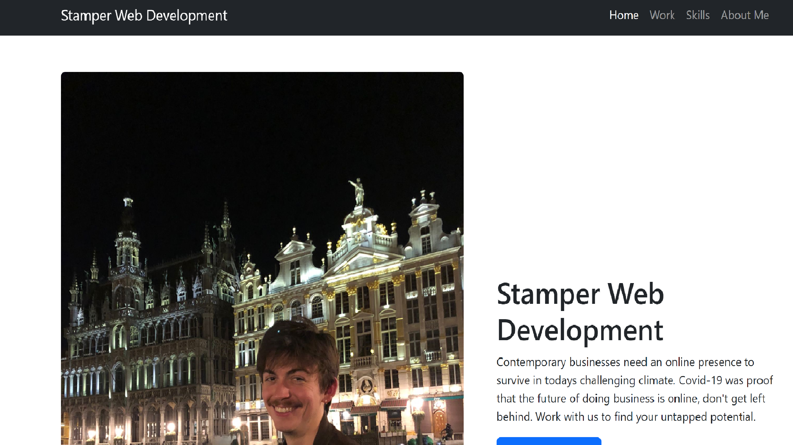

# kolme-bootstrap


## Description

The third challenge culminated of building another portfolio, incorporating bootstrap. Besides the obvious motivation of completing the activity to get graded, I took extra care in this project as it will serve as an illustration to potential employers and clients of my programming ability and evidence of past projects. Given many contained links to websites it could also be used by these parties to get a reference. The lesson it taught me in using bootstrap will be invaluable in the future, given the amount of time bootstrap can save in formating and providing templates


## Table of Contents 


- [Installation](#installation)
- [Usage](#usage)
- [Credits](#credits)
- [License](#license)

## Installation

Copy the SSH key from github.com/kolme-bootstrap.
Clone the SSH locally.


## Usage


Upon opening the webpage, use the navigation bar at the top to skip through the page to each section.
    

```md
    
    ```

Once you have navigated to the work section, you may navigate to each external project by clicking on the appropriate section.

```md
    
    ```


## Credits

https://bootcampspot.instructure.com/

https://getbootstrap.com/

## License

MIT Licencce


## Contributions

[Contributor Covenant](https://www.contributor-covenant.org/) 
